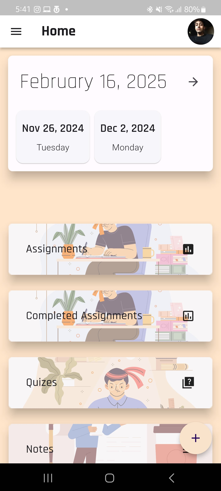
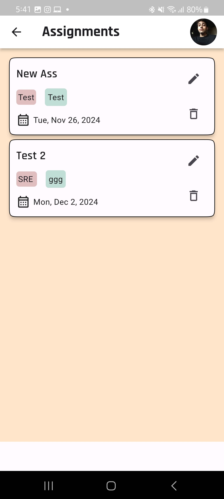
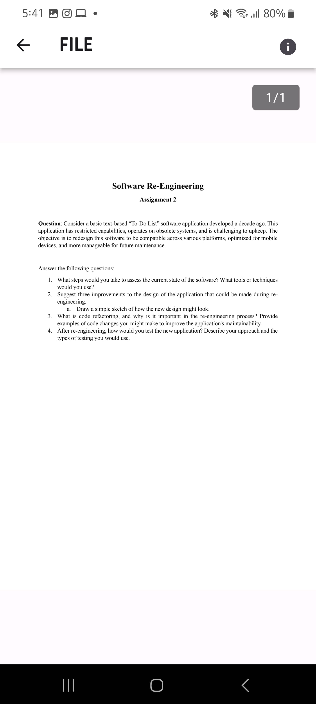
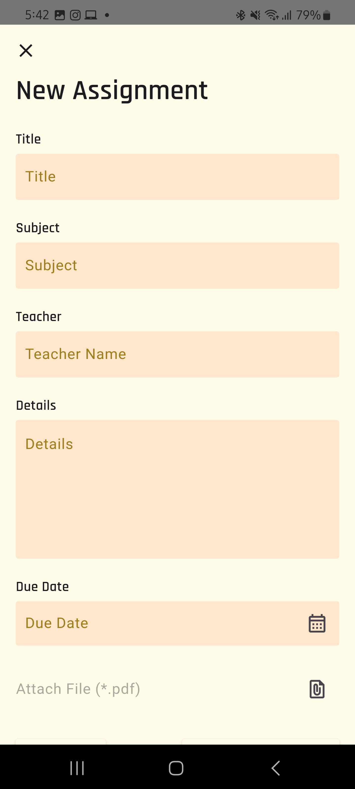

# 📚 StudU - Student Self-Management App

StudU is a **student self-management app** designed to help students organize their academic life. Users can:

- Track assignments, quizzes, and completed tasks
- Upload notes and PDF files for easy access
- Receive notifications for upcoming tasks
- Manage personal info, including profile photos

---

## 🚀 **Features**

- **User Authentication** using Firebase (Email/Password)
- **Assignment and Quiz Management**
- **PDF Uploads** for notes and assignments
- **Notification Service** for task reminders
- **Profile Management** with photo upload
- **AdMob Integration** for monetization
- **Backend Integration** for **reading assignments** and **fetching related links**
  - This backend is currently **offline**.
  - You can implement your own backend to fetch relevant web links related to assignment topics.

---

## 📸 **Screenshots**

**Home Screen**  


**Assignment Screen**  


**PDF Screen**  


**Login Screen**  


**Add Assignments**  


---

## 🔧 Tech Stack

- **Flutter** for cross-platform development
- **Firebase** for Authentication, Firestore, and Storage
- **AdMob** for ads monetization
- **Backend (Optional)** for fetching related links (You can add your own solution)

---

## 📲 Getting Started

Follow these steps to set up the project on your local machine:

### 1. Clone the Repository

```bash
git clone https://github.com/your-username/StudU.git
cd StudU
```

### 2. Install Dependencies

```bash
flutter pub get
```

### 3. Firebase Configuration

- Go to Firebase Console and create a new project.
- Add Android and iOS apps to your Firebase project.
- Download `google-services.json` for Android and `GoogleService-Info.plist` for iOS.
- Place them in the following directories:
  `android/app/google-services.json`
  `ios/Runner/GoogleService-Info.plist`
- Make sure to add these to `.gitignore` to keep them secure.

### 4. Configure Firebase in Flutter

Run the following command to auto-generate `firebase_options.dart`:

```bash
flutterfire configure
```

If you prefer manual setup, create a file named:

```bash
lib/firebase_options.dart
```

---

## 🔗 Backend Integration for Assignment Links

StudU now supports a backend for reading assignments and fetching related web links relevant to assignment topics.

- The backend is currently offline, but you can add your own backend.
  <br>**Suggested Tech Stack**:
- 1. Node.js with Express
- 2. Python with Flask/Django
- 2. Firebase Cloud Functions

To integrate your own backend:

1. Set up your backend server to read assignments and use NLP for topic modeling.
2. Expose an API endpoint that takes assignment data and returns relevant web links.
3. Update API URL in the Flutter app to point to your backend endpoint.

---

## 📢 AdMob Integration

1. Go to AdMob Console and create new Ad Units.
2. Add your AdMob App ID in `android/app/src/main/AndroidManifest.xml`:

```bash
<meta-data
    android:name="com.google.android.gms.ads.APPLICATION_ID"
    android:value="@string/admob_app_id" />
```

3. Store the App ID in gradle.properties (this file is already in .gitignore):

```bash
ADMOB_APP_ID=ca-app-pub-xxxxxxxxxxxxxxxx~xxxxxxxxxx
```

### 4. Add Ad Unit IDs in `config.dart`

Create a configuration file for sensitive info:

```bash
// lib/config.dart
const String bannerAdUnitId = "ca-app-pub-xxxxxxxxxxxxxxxx/xxxxxxxxxx";
const String interstitialAdUnitId = "ca-app-pub-xxxxxxxxxxxxxxxx/xxxxxxxxxx";
```

---

## 🔑 Setup Environment

- Ensure **Flutter SDK** is installed: Flutter Setup
- Connect your IDE (VSCode/Android Studio) with Flutter and Dart plugins.
- Run the app on an emulator or a real device:

```bash
flutter run
```

---

## 🎨 Configuring config.dart

You must create a `config.dart` file in the `lib` directory with your **AdMob Unit IDs** and any other sensitive configurations:

```bash
// lib/config.dart
const String bannerAdUnitId = "YOUR_BANNER_AD_UNIT_ID";
const String interstitialAdUnitId = "YOUR_INTERSTITIAL_AD_UNIT_ID";
```

---

## 💬 Contact

For any queries or suggestions, feel free to reach out:

- Email: **ahmedikram2003@gmail.com**
- LinkedIn: **https://www.linkedin.com/in/ahmed-ikram-94496a250/**
